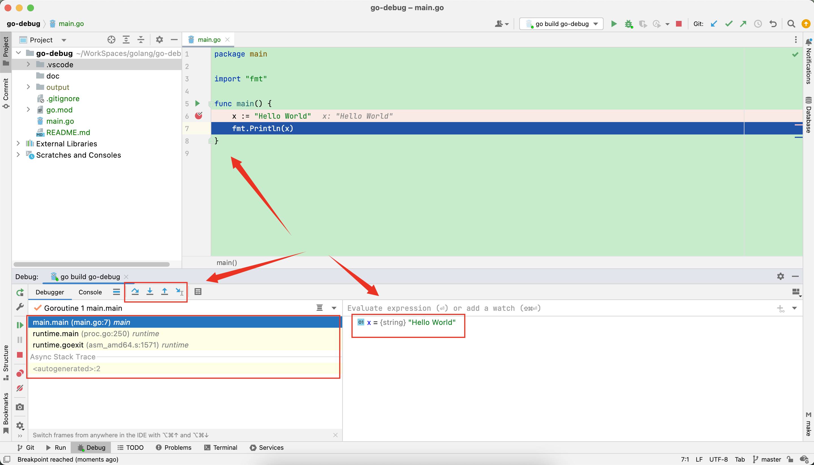
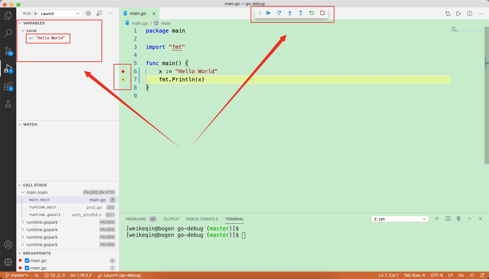

# go debug

# 编译运行go文件

实验配置
```shell
GOROOT=/usr/local/go 
GOPATH=/Users/weikeqin/gopath 
```

```shell
# 编译 main.go  
# 把mian.go编译成可执行文件 /Users/weikeqin/WorkSpaces/golang/go-debug/output/main 
/usr/local/go/bin/go build -o /Users/weikeqin/WorkSpaces/golang/go-debug/output/main  /Users/weikeqin/WorkSpaces/golang/go-debug/main.go

# 运行 main 
/Users/weikeqin/WorkSpaces/golang/go-debug/output/main 
```
 
# goland本地debug

打个断点，直接debug

 

```shell
[weikeqin@bogon go-debug (master)]$ ps -ef | grep dlv 
  501 57361 56259   0  8:01PM ttys011    0:00.19 /Applications/GoLand.app/Contents/plugins/go/lib/dlv/mac/dlv --listen=127.0.0.1:60876 --headless=true --api-version=2 --check-go-version=false --only-same-user=false exec /private/var/folders/ry/j30lp1sn19q7rbtq6020f6880000gn/T/GoLand/___1go_build_go_debug --
  501 57385 57011   0  8:01PM ttys018    0:00.01 grep dlv
[weikeqin@bogon go-debug (master)]$ 
```

```sh
# 编译main.go 并输出到指定目录
/usr/local/go/bin/go build -o /private/var/folders/ry/j30lp1sn19q7rbtq6020f6880000gn/T/GoLand/___1go_build_go_debug -gcflags all=-N -l go-debug #gosetup

# 使用dlv以debug模式运行
/Applications/GoLand.app/Contents/plugins/go/lib/dlv/mac/dlv --listen=127.0.0.1:60876 --headless=true --api-version=2 --check-go-version=false --only-same-user=false exec /private/var/folders/ry/j30lp1sn19q7rbtq6020f6880000gn/T/GoLand/___1go_build_go_debug --
```

# vscode本地debug



```shell
[weikeqin@bogon go-debug (master)]$  ps -ef | grep dlv 
  501 57165 57163   0  7:59PM ??         0:00.14 /Users/weikeqin/gopath/bin/dlv debug --headless=true --listen=127.0.0.1:27722 --api-version=2
  501 57222 42563   0  8:00PM ttys006    0:00.00 grep dlv
[weikeqin@bogon go-debug (master)]$ 
```

```log
API server listening at: 127.0.0.1:27722
```


